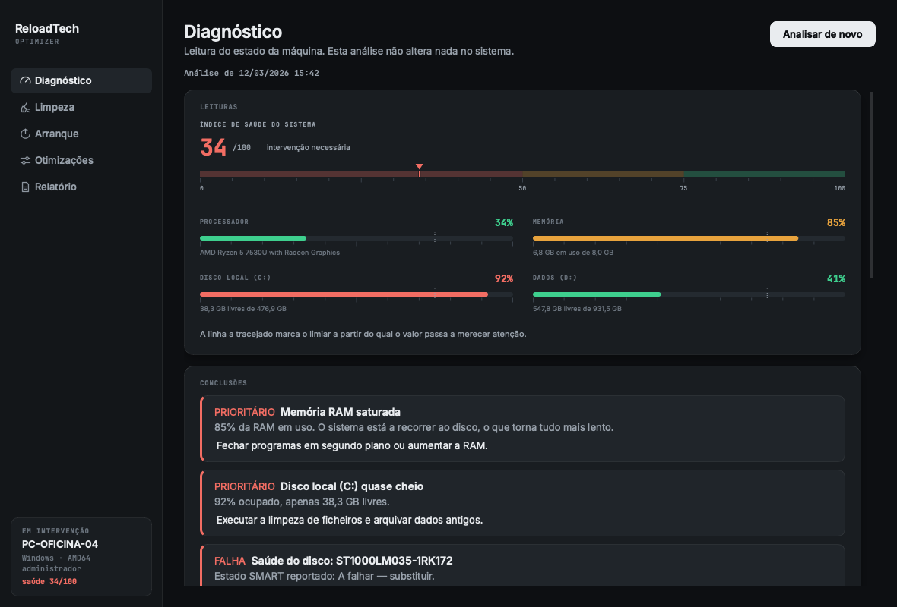

# ReloadTech Optimizer

Ferramenta de diagnóstico, limpeza e otimização de computadores, para **Windows, macOS e Linux**.
Feita para uso em loja: analisa a máquina do cliente, faz a manutenção e gera o relatório que fica com ele.

Em servidores funciona inteiramente por linha de comandos — a interface gráfica é opcional.



---

## O que faz

| | |
|---|---|
| **Diagnóstico** | Processador, memória, discos (SMART), gráfica, bateria, temperaturas e processos mais pesados. Só lê — não altera nada. |
| **Limpeza** | Temporários, caches de navegadores, logs antigos, cache de pacotes, lixo. Analisa primeiro, mostra o que vai apagar, e só depois limpa. |
| **Arranque** | Lista tudo o que arranca com o sistema (registo e pastas no Windows, LaunchAgents no macOS, autostart e systemd no Linux) e permite desativar. Sempre reversível. |
| **Otimizações** | Ajustes concretos ao sistema e a serviços, cada um com o risco e o benefício declarados. Os que são interruptores revertem-se com um clique. |
| **Relatório** | Documento em PDF ou HTML com o diagnóstico, as intervenções feitas e as observações do técnico. |

## O que **não** faz

Esta ferramenta não promete «+300 % de velocidade» nem limpa o registo às cegas. Isso é o que fazem os
*fake optimizers*, e partem máquinas. Aqui:

- Nada é apagado sem uma análise prévia mostrada no ecrã.
- Documentos, transferências e dados de utilizador nunca são tocados.
- Serviços essenciais (SSH, rede, journald, cron) estão protegidos e não podem ser desativados.
- Tudo o que é alterado fica registado em `operacoes.log`.
- Cada otimização diz o que faz **antes** de a aplicares.

---

## Instalação

### Linux e servidores

```bash
git clone https://github.com/Martim-pinho/reloadtech-optimizer.git
cd reloadtech-optimizer
./install.sh              # só a linha de comandos (servidores)
./install.sh --gui        # com interface gráfica (desktops)
```

Ou como pacote Debian/Ubuntu:

```bash
./packaging/build-deb.sh
sudo apt install ./build/reloadtech-optimizer_1.0.0_all.deb
```

### macOS e Windows

```bash
pip install ".[completo]"
reloadtech --gui
```

Para gerar um `.exe` ou `.app` autónomo:

```bash
pip install pyinstaller
python packaging/build-desktop.py
```

No Windows, abre como administrador para poder mexer em serviços do sistema.

---

## Utilização

### Interface gráfica

```bash
reloadtech
```

### Linha de comandos

```bash
reloadtech diagnostico                       # análise completa no terminal
reloadtech diagnostico --json                # para integrar com outras ferramentas
reloadtech diagnostico --pdf --cliente "Nome do cliente"

reloadtech limpeza                           # analisa, não apaga nada
reloadtech limpeza --executar --seguros --sim

reloadtech arranque --detalhado
reloadtech arranque --desativar "systemd::cups.service"

reloadtech otimizacoes                       # lista o que está disponível
reloadtech otimizacoes --aplicar swappiness

reloadtech registo                           # histórico do que a ferramenta alterou
```

### Manutenção automática num servidor

Rotina não interativa: limpeza de risco baixo, diagnóstico e relatório.
Sai com o código `2` quando encontra algo crítico, o que a torna utilizável em monitorização.

```bash
sudo cp packaging/reloadtech-manutencao.* /etc/systemd/system/
sudo mkdir -p /var/log/reloadtech
sudo systemctl enable --now reloadtech-manutencao.timer
```

---

## Estrutura

```
reloadtech/
  platform_info.py     deteção de sistema, execução de comandos, elevação
  storage.py           registo de operações e estado para reverter alterações
  cli.py               linha de comandos (a interface usada em servidores)
  core/
    diagnostics.py     recolha de dados e avaliação — só de leitura
    cleaner.py         alvos de limpeza por sistema, análise e remoção
    startup.py         programas e serviços de arranque
    tweaks.py          otimizações de sistema, aplicar e reverter
    report.py          relatório em HTML e PDF
  ui/
    theme.py           identidade visual (QSS)
    gauges.py          escalas calibradas desenhadas com QPainter
    app.py             janela principal
    pages/             uma página por área de trabalho
```

## Design

A interface segue três regras:

1. **A cor significa o estado de uma medição.** Verde, âmbar e vermelho aparecem só em leituras e
   veredictos; a ação principal distingue-se por contraste, não por cor. Num aparelho de diagnóstico,
   se o botão «Limpar» também fosse colorido, a cor deixaria de querer dizer alguma coisa.
2. **As escalas mostram a régua, não só o número.** Cada medição aparece numa escala graduada com o
   limiar de atenção visível, desenhada com `QPainter`, para que o valor não pareça arbitrário.
3. **A elevação transmite hierarquia.** Quatro níveis de superfície, do fundo da janela ao elemento
   em foco, e um espaçamento que sai sempre da mesma escala.

Os tipos de letra (Inter e JetBrains Mono, ambos OFL) vêm no repositório, em `reloadtech/ui/fontes/`.
Sem eles o Qt cai na primeira família instalada — no macOS, Helvetica Neue — e a aplicação ganha
um ar de software de há vinte anos. Os ícones são traçados em código, sem ficheiros de imagem.

O relatório entregue ao cliente é claro, não escuro: é um documento para ler e imprimir.

## Requisitos

- Python 3.10 ou superior
- `psutil` (obrigatório), `reportlab` (PDF), `PySide6` (interface gráfica)
- Linux: `smartmontools` para o estado SMART dos discos
- Os tipos de letra estão incluídos; não é preciso instalar nada no sistema

## Licença

MIT — ver [LICENSE](LICENSE).
